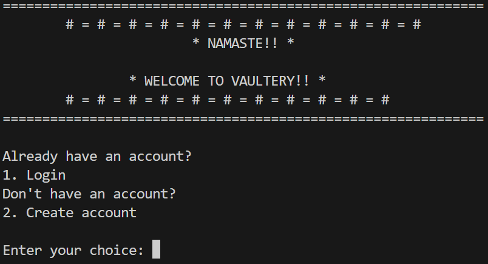
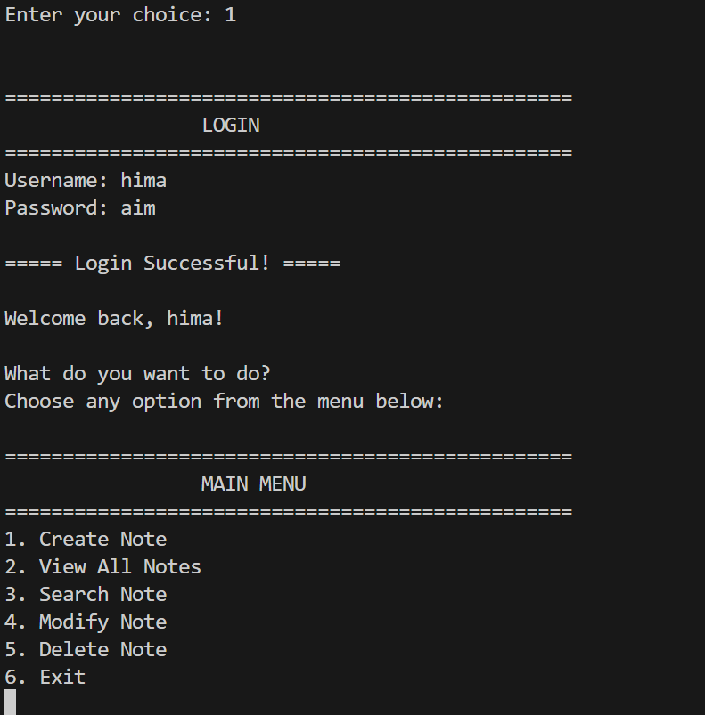
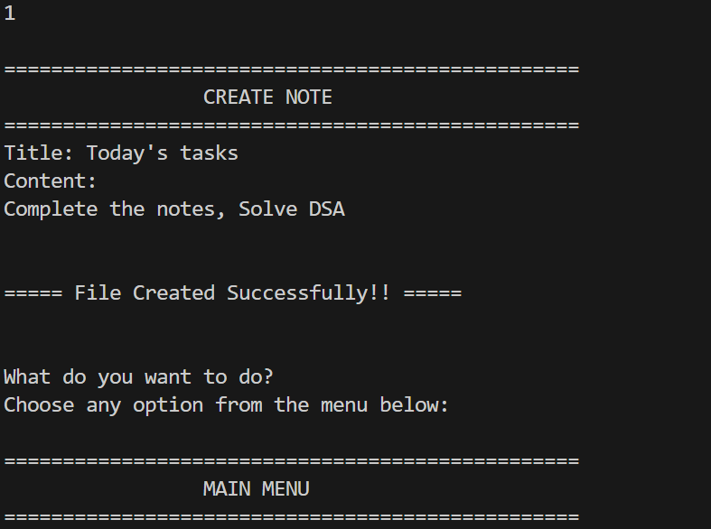

# VAULTERY

A simple CLI-based personal vault built using C++.

Vaultery includes a basic user authentication system and allows users to store and manage personal notes through a command-line interface.
It supports creating, viewing, searching, modifying, and deleting notes using file-based storage.

---------------

## FEATURES

- User authentication (Login & Account creation) 
- Create notes with title and content
- View all saved notes
- Search notes by title
- Modify existing notes
- Delete notes
- File-based storage system

---------------

## TECH STACK

- C++
- File handling (ifstream, ofstream)
- CLI (Command Line Interface)
- Git & GitHub

---------------

## HOW TO RUN

1. Clone the repository

    git clone
    https://github.com/thushara-bajimar/vaultery.git

2. Navigate to the project folder

    cd vaultery

3. Compile the code

4. Run the program

---------------

## SAMPLE OUTPUT

<h3>WELCOME SCREEN</h3>

  

<h3>MAIN MENU</h3>

  

<h3>CREATE NOTE FEATURE</h3>

  

---------------

## LIMITATIONS

- No encryption for stored data
- Single-user system
- CLI-based (no GUI yet)

---------------

## FUTURE IMPROVEMENTS

- Add password encryption
- Add timestamps to notes
- Improve CLI user experience
- Add search by keywords

---------------

### LICENSE

This project is licensed under the MIT License.

---------------

#### AUTHOR 
Thushara B S